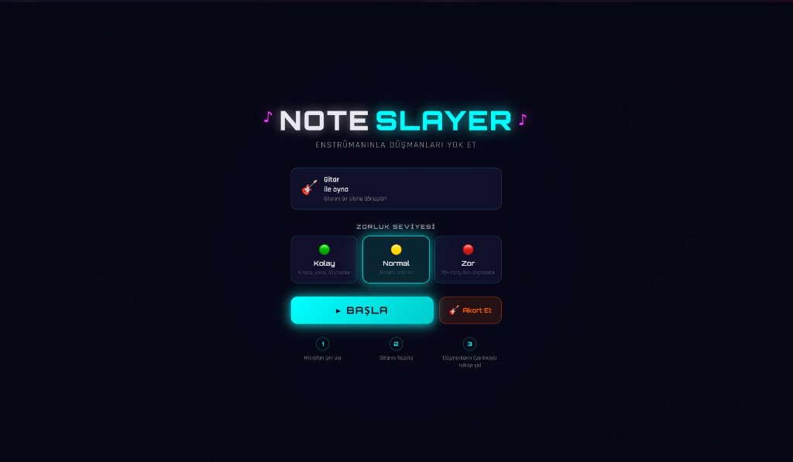
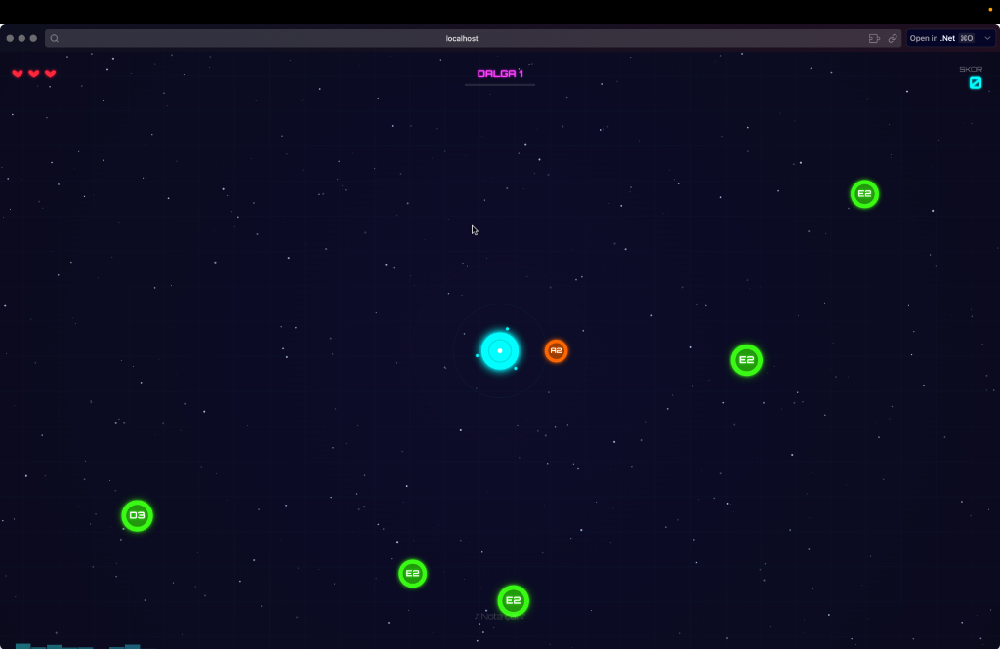

# 🎵 NoteSlayer

**Enstrümanınla düşmanları yok et!**

NoteSlayer, gerçek bir enstrüman (gitar) kullanarak oynanan bir arena savunma oyunudur. Mikrofon aracılığıyla çaldığın notalar algılanır ve ekrandaki düşmanları yok eder.

## 📸 Ekran Görüntüleri

<p align="center">
  
  <br><em>Ana Menü — Zorluk seçimi ve akort özelliği</em>
</p>

<p align="center">
  
  <br><em>Oyun İçi — Düşmanlar her yönden karaktere doğru geliyor</em>
</p>

## 🎮 Nasıl Oynanır?

1. **Gitarını hazırla** ve mikrofonunu aç
2. Ekranın ortasında senin karakterin var — düşmanlar her yönden sana doğru geliyor
3. Her düşmanın üzerinde bir **nota** yazıyor (örn: E2, G3, B3...)
4. O notayı gitarında **çal** → düşman patlar! 💥
5. Düşman sana ulaşırsa can kaybedersin (3 can hakkın var)
6. Her dalga daha zor — daha hızlı düşmanlar, daha çok nota çeşidi

## ✨ Özellikler

- 🎸 **Gerçek Zamanlı Nota Algılama** — Geliştirilmiş YIN algoritması ile düşük gecikmeli, hassas frekans takibi ve perde tespiti.
- 👾 **8 Farklı Düşman Tipi** — Normal'den Dodger'a, Splitter'dan Sequence'a kadar farklı stratejiler gerektiren zengin düşman çeşitliliği.
- 🔊 **Dinamik Ses Efektleri (SFX Motoru)** — Sentezlenmiş 7 farklı ses efekti (öldürme, hasar, kombo, oyun sonu vb.) ile yüksek işitsel geri bildirim.
- 🧭 **Ekran Dışı Yön Göstergeleri** — Görüş alanı dışından yaklaşan düşmanların yönünü gösteren dinamik kılavuz oklar.
- 🎨 **Atmosferik Arka Plan Sistemi** — Kombo artışları, tehlike anları veya Boss savaşlarına göre dinamik olarak renk değiştiren Cyberpunk arka plan.
- 🌊 **Zorluk Bazlı Dalga Sistemi** — Dalga ilerledikçe artan hızlar ve zorluk ayarlarına göre optimize edilmiş düşman spawn oranları.
- 🔥 **Combo Sistemi** — Hata yapmadan çalınan notalarla katlanan puan çarpanı ve combo görsel efektleri.
- 🎛️ **Oyun İçi Akort Aleti (Tuner)** — Gitar teli tınısını Hz seviyesinde ölçen hassas kalibrasyon ekranı.
- 📱 **Geliştirilmiş Mobil Deneyim** — Sağ alt köşede konumlandırılmış hızlı duraklatma butonu, duraklatma menüsü kontrolleri (Devam Et / Ana Menü) ve responsive tasarım.
- 🏆 **Yüksek Skor Kaydı** — En yüksek puanı tarayıcı hafızasında (localStorage) saklama özelliği.

## 👾 Düşman Tipleri

Oyun içinde karşılaşacağınız cyberpunk yaratıklar ve özellikleri:

1. **Normal (Yeşil)**: Klasik tek notalı, temel hızda hareket eden dikenli düşman.
2. **Fast (Turuncu)**: Oyuncuya doğru yüksek hızla süzülen ok/dart şeklinde düşman.
3. **Elite (Kırmızı)**: 2 canı olan ve yok edilmesi için 2 kez notası çalınması gereken dayanıklı altıgen.
4. **Boss (Mor)**: Çok yüksek cana sahip, devasa boyutlarda boynuzlu kafatası şeklinde boss düşman.
5. **Dual (Mavi)**: Üzerinde iki farklı nota barındıran, sırasız çalınabilen düşman.
6. **Sequence (Koyu Mavi)**: Üzerindeki iki notanın sırayla çalınması gereken koordinasyon düşmanı.
7. **Dodger (Turkuaz)**: Kendisine doğru gelen ilk atıştan kaçma yeteneğine sahip hareketli düşman.
8. **Splitter (Açık Yeşil)**: Yok edildiğinde daha küçük ve hızlı iki adet `SplitterMini` düşmana bölünen düşman.

## 🚀 Kurulum & Çalıştırma

```bash
# Projeyi klonla
git clone https://github.com/Nukte/notaSlayer.git
cd notaSlayer

# Herhangi bir HTTP server ile başlat
npx serve . -p 3000

# Tarayıcıda aç
# http://localhost:3000
```

> **Not:** Mikrofon izni gereklidir. Chrome/Edge'de `localhost` üzerinden çalışır.

## 🎼 Desteklenen Notalar

### Kolay Mod (6 nota)
Standart gitar açık telleri:
| Tel | Nota |
|-----|------|
| 6. tel | E2 |
| 5. tel | A2 |
| 4. tel | D3 |
| 3. tel | G3 |
| 2. tel | B3 |
| 1. tel | E4 |

### Normal & Zor Mod
İlk pozisyon notaları dahil 15-20+ nota.

## 🏗️ Teknik Yapı

```
notaSlayer/
├── index.html                 # Ana sayfa (Menüler & Canvas)
├── css/style.css              # Neon cyberpunk stil & responsive layout
├── js/
│   ├── main.js                # Uygulama başlangıç noktası (Init)
│   ├── audio/
│   │   ├── AudioEngine.js     # Mikrofon erişimi & ses işleme hattı
│   │   ├── PitchDetector.js   # YIN pitch detection algoritması
│   │   ├── NoteMapper.js      # Frekans → nota dönüşümü
│   │   └── SFXEngine.js       # Dinamik synth ses efektleri motoru
│   ├── game/
│   │   ├── Game.js            # Ana oyun loop'u ve state yönetimi
│   │   ├── Player.js          # Oyuncu karakteri (Çizim & Kalkan)
│   │   ├── Enemy.js           # Düşman tipleri & özel AI davranışları
│   │   ├── EnemyManager.js    # Düşmanların spawn ve yaşam döngüsü
│   │   ├── DifficultyManager.js # Dalga ilerleyişi & ağırlıklı spawn oranları
│   │   ├── Particle.js        # Yok olma ve hasar efekti parçacıkları
│   │   ├── BackgroundRenderer.js # Grid ve mood-based arka plan render'ı
│   │   └── InputHandler.js    # Klavye ve mobil dokunmatik giriş kontrolcüsü
│   ├── ui/
│   │   ├── HUD.js             # Can, skor, kombo, dalga ve doğruluk yüzdesi
│   │   ├── Menu.js            # Ana menü ekranı ve kalibrasyon yönetimi
│   │   ├── GameOver.js        # Skor paneli ve tekrar oyna ekranı
│   │   ├── TunerController.js # Akort aleti arayüzü ve ibre mekanizması
│   │   └── OffscreenIndicator.js # Ekran dışı düşman kılavuz okları
│   └── utils/
│       ├── constants.js       # Renk paletleri ve denge sabitleri
│       └── helpers.js         # Matematiksel ve geometrik yardımcı fonksiyonlar
```

### Kullanılan Teknolojiler
- **HTML5 Canvas** — 60 FPS akıcı oyun render'ı
- **Web Audio API** — Mikrofon girişi analizi ve gerçek zamanlı ses sentezleme
- **YIN Algoritması** — Kararlı monofonik pitch detection
- **Vanilla JavaScript** (ES6 Modules) — Sıfır dış kütüphane bağımlılığı
- **CSS3 Modern Layout** — Glassmorphism, neon glow ve responsive tasarım

## 🎯 Zorluk Seviyeleri

| | Kolay | Normal | Zor |
|---|---|---|---|
| Nota sayısı | 6 | 15 | 20+ |
| Düşman hızı | Yavaş | Orta | Hızlı |
| Elite düşman | 8. dalga+ | 5. dalga+ | 3. dalga+ |
| Boss | 10. dalga+ | 5. dalga+ | 5. dalga+ |

## 📋 Yol Haritası

- [x] Web Audio API synth tabanlı dinamik ses efektleri
- [x] Mobil uyumlu duraklatma ve menü kontrolleri
- [x] Ekran dışı düşman yön göstergeleri
- [x] 4 yeni ileri seviye düşman tipi (Dodger, Splitter vb.)
- [ ] Akor algılama (çoklu nota tespiti)
- [ ] Farklı enstrüman kalibrasyon desteği (piyano, ukulele vb.)
- [ ] Özel şarkı/nota dizileri ile bölüm tasarımı modu
- [ ] Çok oyunculu arena modu

## 📄 Lisans

MIT

---

<p align="center">
  <b>🎸 Gitarını al, düşmanları yen! 🎸</b>
</p>
